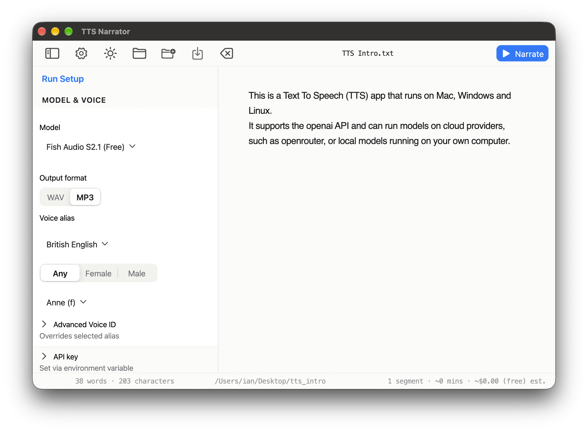

# tts-narrator

**tts-narrator** turns text into spoken audio. Paste a chapter or an article
into the window, pick a voice, and press **Narrate** — it writes out a folder of
audio files you can play back without leaving the app.



<!-- TODO: replace the screenshot above with a short demo video once one exists. -->

- **Any provider** — OpenRouter's Gemini and Kokoro, Fish Audio, or your own
  OpenAI-compatible endpoint.
- **Cloud or fully local** — point it at a local server and nothing leaves the
  machine.
- **Resumable** — progress is written per segment, so an interrupted run picks
  up where it stopped instead of starting over.
- **Editor-first** — no project files and no import step; type or paste and go.

Under the hood it splits your text into segments, calls a text-to-speech engine
for each one, and saves the results as audio files. Every engine is reached over
the same OpenAI-compatible `/audio/speech` protocol, so cloud and local
narration differ only by configuration: a cloud TTS provider and a local audio
server such as [mlx-audio](https://github.com/Blaizzy/mlx-audio) (Apple
Silicon).

## Getting started

To run the application in development:

| Platform | Command                      | Setup instructions       |
|----------|------------------------------|--------------------------|
| macOS    | `fvm flutter run -d macos`   | [MAC.md](MAC.md)         |
| Linux    | `fvm flutter run -d linux`   | [LINUX.md](LINUX.md)     |
| Windows  | `fvm flutter run -d windows` | [WINDOWS.md](WINDOWS.md) |

(Run from the `app` directory; prefix with `cd app` if you're at the repo root.)

For pre-built releases, see [Download & Installation](#download--installation) below.

## Download & Installation

### macOS

Pre-built macOS releases (`TTS Narrator.app`) are available as downloadable `.zip`
archives and `.dmg` installers. Gatekeeper security bypass instructions and
detailed installation steps are documented in **[MAC.md](MAC.md)**. The same file
covers setting up the local OpenAI-compatible audio server (a.k.a. the MLX Audio
server, Apple Silicon only) so the app can narrate fully offline.

### Linux

No pre-built Linux binaries are provided yet. To build and run from source on
Linux, see **[LINUX.md](LINUX.md)**.

### Windows

No pre-built Windows binaries are provided yet. To build and run from source on
Windows, see **[WINDOWS.md](WINDOWS.md)**.

> **Note:** Pre-built releases currently exist only for macOS — the CI workflow
> (`build-macos.yml`) builds and packages macOS binaries only. Linux and Windows
> support is complete in the codebase, but you must build from source.

## Voice configuration

Everything user-facing — which providers exist, per-provider settings, models,
per-model default voices, prices, and friendly voice aliases — lives in a config
**directory** the app manages. Three kinds of file:

- `config.json` — the provider registry: the names of the providers in use, in
  order.
- `providers/<name>.json` — one file per provider: the settings block (secrets, endpoint) and the models it
  serves.
- `models/<alias>.json` — one file per model: its id, the request wiring,
  default voice, pricing, and friendly voice aliases.

Providers name the models they serve, not the other way round, so adding a
model is a matter of dropping a file in `models/` and adding its alias to a
provider's `models`. Order matters: the first provider in the registry is
the default, and the first model in that provider's list is the model
preselected on cold start.

`models` is normally a list, read the same on every platform. When a provider's
models only exist on some platforms — the bundled `local` provider points at
MLX backends, which are Apple-Silicon only — key it by platform instead, and each
platform serves only its own entry:

```json
{
  "models": {
    "macos": [
      "kokoro_local"
    ],
    "linux": [],
    "windows": []
  }
}
```

A platform the map does not name serves nothing, the same as an empty list. The
keys must be `macos`, `linux`, or `windows`; anything else is reported rather
than ignored, since a misspelled one would otherwise leave the provider serving
nothing with nothing to say why. Use this only when the models genuinely differ
per platform — the manifest already decides which model files each platform
downloads, and the two must agree.

The config directory, per platform:

| Platform | Path                                                       |
|----------|------------------------------------------------------------|
| macOS    | `~/Library/Application Support/com.wyrdness.tts-narrator/` |
| Linux    | `~/.local/share/com.wyrdness.tts-narrator/`                |
| Windows  | `%APPDATA%\com.wyrdness.tts-narrator\`                     |

The macOS and Linux paths sit inside a hidden folder, so reveal it first with
`Cmd+Shift+.` on macOS, or `Ctrl+H` in most Linux file managers. On Windows,
`%APPDATA%` is visible by default — paste the path directly into the Explorer
address bar, or press `Win+R` and type `%APPDATA%`.

The files directly in that directory are the ones the app downloaded, and the app
never rewrites them. Your own changes live in a `user/` subdirectory alongside
them, and shadow their counterparts by name — see
[Your own overrides](#your-own-overrides) below.

`<config_dir>/config.json`:

```json
{
  "providers": [
    "openrouter",
    "local"
  ]
}
```

`<config_dir>/providers/openrouter.json`:

```json
{
  "models": [
    "fish",
    "gemini",
    "kokoro"
  ],
  "settings": {
    "base_url": "https://openrouter.ai/api/v1",
    "api_key": "${OPENROUTER_API_KEY}"
  }
}
```

`<config_dir>/providers/local.json` — keyed by platform because its models are
Apple-Silicon only:

```json
{
  "models": {
    "macos": [
      "kokoro_local"
    ],
    "linux": [],
    "windows": []
  },
  "settings": {
    "base_url": "http://localhost:8000/v1"
  }
}
```

`settings` is a flat map of strings for one service. The keys the app reads:

| Setting         | Required | Meaning                                                                                                                                                                                                        |
|-----------------|----------|----------------------------------------------------------------------------------------------------------------------------------------------------------------------------------------------------------------|
| `base_url`      | yes      | the speech endpoint **root**, e.g. `https://openrouter.ai/api/v1`. The app appends `/audio/speech`, so do not include that part. A trailing slash is normalized                                                |
| `endpoint`      | no       | documented alias for `base_url`, for configs that already use that name. Carries the same root semantics                                                                                                       |
| `api_key`       | no       | the credential: a literal key, or a `${VAR}` reference read from the environment. Never sent as a normal setting — it is stripped out and delivered separately, so a secret is not carried in the settings map |
| `default_voice` | no       | voice id to use when the request names none. Fills a gap only; an explicitly chosen voice always wins                                                                                                          |

Every other key passes through untouched to the service as a request setting,
so a vendor can take options the app knows nothing about.

You can also enter a key in the Run Setup panel instead, and it is stored in the
OS keychain. That wins over the config block, because the provider file is
downloaded from a remote and may carry someone else's key. The app never
requires a key: if none is configured, the request carries no `Authorization`
header and the server decides whether it needed one.

`<config_dir>/models/fish.json`:

```json
{
  "id": "fish-audio/s2.1-pro-free",
  "formats": [
    "wav",
    "mp3"
  ],
  "wav_response_format": "pcm",
  "default_voice": "British Female Narrator",
  "voices": {
    "British Female Narrator": "89f41ea230034706881f85a8227d6ab9",
    "British War": "2fd511bd06904a21a971c6551dfb853a"
  }
}
```

`<config_dir>/models/gemini.json`:

```json
{
  "id": "google/gemini-3.1-flash-tts-preview",
  "formats": [
    "wav"
  ],
  "wav_response_format": "pcm",
  "prompt_style": true,
  "default_voice": "Charon",
  "pricing": {
    "input_usd_per_m_tokens": 1.0,
    "output_usd_per_m_tokens": 20.0
  },
  "voices": {
    "Charon": "Charon",
    "Zephyr": "Zephyr"
  }
}
```

`<config_dir>/models/kokoro.json`:

```json
{
  "id": "hexgrad/kokoro-82m",
  "formats": [
    "wav",
    "mp3"
  ],
  "wav_response_format": "pcm",
  "sends_language": true,
  "default_voice": "bf_emma",
  "default_language": "b",
  "languages": {
    "b": "British English",
    "a": "American English",
    "j": "Japanese"
  },
  "pricing": {
    "usd_per_m_chars": 0.62
  },
  "voices": {
    "bf_emma": {
      "name": "Emma"
    },
    "bm_lewis": {
      "name": "Lewis"
    }
  }
}
```

## Models

Model differences drive how requests are built:

| Alias               | Voice format                                            | Prompt styling                            | Output                         |
|---------------------|---------------------------------------------------------|-------------------------------------------|--------------------------------|
| `fish` (default)    | free-form 32-hex fish.audio id                          | ✗ (read aloud — prompt styling disabled) | `.wav` or `.mp3` (free)        |
| `gemini`            | named voices (rated on the OpenRouter page)             | ✓ (accent/style/`[calm]`)                | `.wav`                         |
| `kokoro`            | Kokoro-82M voices (54 voices, 9 languages, keyed by id) | ✗ (read aloud — prompt styling disabled) | `.wav` or `.mp3`               |
| `kokoro_local`      | same Kokoro-82M voices                                  | ✗ (read aloud — prompt styling disabled) | `.wav` or `.mp3` (local, free) |
| `qwen3_voicedesign` | ✗ (none — the voice is described, not chosen)          | ✗ (prose voice design instead)           | `.wav` or `.mp3` (local, free) |

A model's `formats` list is a promise its backend keeps: the first entry is the
default, and a model offering both gets an **Output format** segmented control
under the model dropdown in the Run Setup panel, with your pick remembered per
model across restarts. A model declaring one format shows no control. Every
shipped model leads with `"wav"` — the container that plays everywhere without a
decoder dependency.

What a run asks for and what it writes are two different things, and the model
file says how they relate. `"formats"` names the containers you can choose from.
`"wav_response_format"` names the wire value used when you chose `wav`: absent
means the backend returns a finished WAV container, while `"pcm"` means it
returns headerless samples and the app writes the WAV header itself, using the
sample rate the response reports. That second key is needed because the two
backends disagree, and neither could be guessed from their published schemas:

- OpenRouter's `response_format` accepts `mp3` and `pcm` only. Requesting `wav`
  is rejected by OpenRouter's own request validator before a model is even
  chosen, so it serves no WAV container for any model. Its `pcm` responses carry
  `audio/pcm;rate=24000;channels=1`, so the rate to write is in the response.
- The local mlx-audio server returns a real `RIFF`/`WAVE` container for `wav`,
  which is why its model files omit `wav_response_format`. Its `mp3` needs
  `ffmpeg` on the path for mlx-audio to encode, so a local model's MP3 option
  depends on your machine rather than on the model.
- Gemini is the one model with no MP3: OpenRouter routes it to a provider that
  rejects `response_format=mp3` outright. Its file declares `"formats": ["wav"]`
  and `"wav_response_format": "pcm"`.

These were checked by calling each endpoint, not by reading its schema — the
schemas advertise values their providers reject. `packages/core/test/shipped_voice_config_test.dart`
pins the result, so a model file that drifts from what its backend serves fails
the tests rather than the first run.

Default voice per model: `fish`=`89f41ea230034706881f85a8227d6ab9` ("British
Female Narrator", the free default), `gemini`=Charon, `kokoro`=`bf_emma` ("Emma"),
`kokoro_local`=`bm_george` ("George"). The voice can be selected in the GUI
Run Setup panel. `qwen3_voicedesign` has no default voice and no voice dropdown:
it declares `"sends_voice": false` and describes the narrator in prose instead
(see [docs/QWEN3_VOICEDESIGN.md](docs/QWEN3_VOICEDESIGN.md)).

Gender tags drive a narrator-gender filter (and, for prompt-driven models, may
rewrite the "narrator" phrase in the passage prefix). Tagging is per-voice and
inline: a voice may carry an optional `gender` (`male`/`female`/`neutral`) in its
own entry, and either the id or the name you know it by resolves to the same
voice. Fish shows the tagged form, keyed by the label it displays and spelling
out the provider's own id: `"Alice": {"id": "c536c6cdbe8e4d9484232e78ab80020f",
"gender": "female"}`.

A model whose ids are already display labels can skip the object entirely and
list them bare — which is what `gemini.json` does, since Gemini's thirty voice
names are themselves the provider ids:

```json
{
  "voices": [
    "Achernar",
    "Charon",
    "Zephyr"
  ]
}
```

Each entry there is its own key, id and label, so there is nothing to repeat. A
voice needing a name or gender uses the object form instead. Plain-string entries (`"Charon": "Charon"`) load too.

Configs ship with fish tagged (from its curated list) and gemini untagged —
gemini's named voices carry no published gender signal, so instead a model that
sets `"prompt_style": true` gets a "Narrator gender" control in the Run Setup
panel's Model options, which gemini does. The two Kokoro files declare no gender
tags at all: they set `languages`, and that declaration is the evidence that their
ids follow the `<lang><gender>_<name>` convention, so gender is read off the
second character (see [docs/KOKORO.md](docs/KOKORO.md)).

A model that declares a `languages` table gets a Language dropdown above the
voice picker, which narrows the list to that language and re-picks a voice when
the current one is filtered away. It starts on the model's `default_language`.
When the model also sets `"sends_language": true`, the selected code travels to
the provider as `lang_code` (the same opt-in shape as `"speed"`); models without
the flag never see the field. For Kokoro the code is simply the first letter of
the voice id — see [docs/KOKORO.md](docs/KOKORO.md).

A model that declares `"sends_instruct": true` sends no voice id and instead gets
a multiline **Voice design** box in Model options, prefilled from the model
file's `default_instruct` and sent as the request body's `instruct` field. Only
`qwen3_voicedesign` uses it. That prose describes the narrator and is never
spoken, unlike `accent`/`style`, which are woven into the text the model reads
aloud. You can clear the box and type a fresh description from scratch; while
it is blank the run is blocked, because a voice-design model has no voice list
to fall back on and the server would only be guessing.

Add or swap a model by editing its `models/<alias>.json` file, and adding a new
one by dropping it in `models/` and listing its alias in some provider's
`models`. It then becomes selectable via the model dropdown in the UI.

### Gemini voices

Voices are the named ones on the OpenRouter page (e.g. `Charon`, `Zephyr`,
`Puck`). Add friendly aliases for the ones you use under `voices` in
`models/gemini.json` — the drop-down shows whatever you configure. Any unlisted id
still works via the raw-id field in the Run Setup panel.

### Kokoro voices

The Kokoro model has two flavors: the cloud `kokoro` above, and `kokoro_local`
for the local OpenAI-compatible audio server (the `local` provider above, Apple
Silicon's MLX Audio runtimes — it needs no API key). Both speak all 54 Kokoro-82M
voices across 9 languages, and each voice id is `<lang><gender>_<name>`: the
first letter is the language (which is also the `lang_code` sent to the
provider) and the second is the gender. British English (`b`) is the default;
`bf_*`/`bm_*` are the British female/male voices, `af_*`/`am_*` American, `jf_*`
Japanese, and so on — the full table is in [docs/KOKORO.md](docs/KOKORO.md).

The `voices` map in both model files is keyed by the raw voice id and carries the
friendly name inside the entry (`"bf_emma": {"name": "Emma"}`), because the names
collide across languages (`Santa`, `Dora`, `Alex` and `Alpha` each exist more
than once) while the ids are unique — the dropdown shows the names and the id is
what gets sent. Any unlisted id still works via the raw-id field in the Run Setup
panel.

### Fish voices

Voices are free-form 32-hex fish.audio ids (the default is
`89f41ea230034706881f85a8227d6ab9`, "British Female Narrator"). Any id is
accepted; a curated British voice list lives on the "Text to Speech" Logseq
page and in `voice-config/models/fish.json`.

Fish is the model to reach for when you want more voices than ship by default:
they are just ids, so any the service accepts can be added — from the
settings screen, or by hand in `user/models/fish.json` (copy the downloaded
file first; see [Your own overrides](#your-own-overrides)). The curated 27 are
an example set, not a limit. An unlisted id also still works via the raw-id
field in the Run Setup panel.

## Your own overrides

The starter configuration is downloaded from the project's repository, so the app
treats the files it downloaded as read-only: editing one in place would be undone
the next time a missing file is re-fetched. Instead, put your changes in a `user/`
directory inside the same config directory:

```
<config_dir>/
├── config.json              ← downloaded
├── manifest.json            ← downloaded
├── providers/               ← downloaded
├── models/                  ← downloaded
└── user/                    ← yours
    ├── config.json              (optional)
    ├── providers/               (optional)
    └── models/                  (optional)
```

A file in `user/` **shadows** the downloaded file of the same name. To change one
model's voices, `user/models/fish.json` is the only file you need to add — but it
becomes the *whole* model file, so start by copying the downloaded one and editing
the copy.

- **Model and provider files replace, they do not merge.** A `user/models/fish.json`
  is read as the entire `fish` model; nothing is carried over from the downloaded
  copy. That is deliberate: a voice list is easier to reason about when the file
  you edit says everything about the model than when two half-files have to agree.
- **Registries add up.** A `user/config.json` is merged with the downloaded one, so
  listing a provider name there registers it without dropping the others. The
  first provider listed wins, so an override you add there takes precedence — and
  that is also how you *reorder* providers, since overriding a provider file alone
  deliberately does not move it.
- **You do not need to re-list a provider you are only overriding.** Dropping
  `user/providers/openrouter.json` next to the downloaded one is enough. Re-listing
  a name the downloaded registry already has is harmless too; it just adds nothing.
- A model still has to be claimed by some provider's `models` list, or it is
  ignored. Overriding an existing model needs no change there; adding a brand new
  one does.
- Anything a hand-written file gets wrong is reported in the app's **Config
  warnings** banner rather than failing the launch, and a malformed override
  falls back to the downloaded file.

### Editing voices in the app

**TTS Narrator → Settings…** (`Cmd+,` on macOS, `Ctrl+,` elsewhere) opens a
providers and voices screen: a model list on the left, and for the selected model
its id, provider and offered output formats, plus a table of voices you can add, rename, re-gender,
remove, and choose a default from.

Only models whose file sets `"voices_editable": true` can be edited — of the
shipped models that is `fish`, whose voices are free-form ids. The others (`gemini`, `kokoro`, `kokoro_local`) have a
fixed voice set, so their table is
read-only; to change one, copy its downloaded `models/<alias>.json` into
`user/models/`, add `"voices_editable": true` to your copy, and edit it there.
The screen has a **Reveal Config Folder** button for finding the directory.

Every save goes to `user/models/<alias>.json`. Your downloaded files are never
touched, and **Revert to Downloaded** deletes the override so the shipped file
shows through again. A model you have overridden is marked with a dot in the
list.

Two things the editor refuses rather than guessing:

- **Removing the model's default voice.** Point the default somewhere else first —
  a model with no default cannot be narrated with at all.
- **Two voices with the same id**, or the same label, since only one of each would
  ever reach the picker.

The editor writes one voice shape — the key is the label, the id is always stated
explicitly, and `gender` appears when tagged:

```json
{
  "voices": {
    "British Female Narrator": {
      "id": "89f41ea230034706881f85a8227d6ab9"
    },
    "Alice": {
      "id": "c536c6cdbe8e4d9484232e78ab80020f",
      "gender": "female"
    }
  }
}
```

It normalises your file to that shape on the first save, so an entry written as
`{"name": "Emma"}` against a `bf_emma` key becomes `{"id": "bf_emma"}` keyed
`Emma`. Nothing is lost: Kokoro-style language prefixes are read off the **id**,
not the key, so such a model keeps working.

## Output

Each segment is written to an output folder you choose (default: a
`tts_narrator_output` folder under the system temp directory), as
`<input-stem>/<input-stem>_<nn>.<ext>` (padded to the width of the segment
count, so files sort numerically), plus a `manifest.json` describing the run.

The `<input-stem>/` subdirectory is per *document*, so several documents can
share one chosen output folder without colliding. A document that has never been
saved has no filename to name a folder after, so its files go straight into the
folder you chose: `untitled_01.mp3` … `untitled_16.mp3` next to the
`manifest.json`, with no `untitled/` folder. The editor status bar shows the
directory a run will actually use.

The extension comes from the format you picked in the Run Setup panel, so
`story.txt` on a `.mp3` model → `<out>/story/story_01.mp3` … `story_16.mp3`; the
same story on a `.wav` model → `story_01.wav` … `story_16.wav`. The bytes are
what the provider returned, except where the model file's
`"wav_response_format": "pcm"` says the backend sends headerless samples, in
which case the app writes the WAV header itself before the first sample.

The manifest is rewritten after every segment, so an interrupted run can be
picked up without re-generating completed paragraphs.

Manifest contents:

- `model`, `voice`, optional `voice_label` (friendly alias if used), optional
  `language` (only when the model sends one), and `format`
- per-segment `wav`, `bytes`, `excerpt`, and the exact
  `input`/`prompt` that produced it (for reproducibility)

Playback: The app has built-in audio playback — click any completed segment in
the run view to play it without leaving the app. To play a clip with an external
player, use `afplay <out>/story/story_01.mp3` (macOS), or `aplay` / `paplay`
(Linux).

## How narration text is segmented

By default the text is segmented so each paragraph gets a controlled,
consistent reading:

1. Split the input on blank lines into paragraphs.
2. Merge a paragraph into the next when it is shorter than the "Min words per segment" setting (default 30), so isolated
   short fragments aren't given their own
   off-register reading.
3. Any merged paragraph longer than 4,000 characters is split at sentence
   boundaries.
4. Each resulting segment is one call to the TTS API.

Toggle **Send whole file** in the GUI to bypass
segmentation entirely: the whole document is sent to the TTS engine as a single
call. The "Min words per segment" setting is hidden and ignored in this mode.
Whole-file narration is limited to 60,000 characters (roughly an hour of audio)
so a runaway document isn't sent as one unbounded request — the GUI hides the
toggle above that size and rejects the plan with a clear error.

The mood of Gemini 3.1 Flash TTS is controlled through the prompt text (accent/style/`[calm]`, accent/style
descriptions) rather than a separate
pitch/rate parameter. There is no per-call voice memory, so keeping the prompt
identical and segment sizes in the ~30–300 word range produces the most
consistent narrator.

## GUI

A Flutter desktop app (`app/`) provides an editor-first interface: type or
paste the text you want narrated right into the window (no backing file — the
core reads the in-memory text via `sourceText`), then click **Narrate**. A collapsible Run Setup panel controls the
model, voice, and
model-specific options (declared by each model's own `models/<alias>.json`), the run view
shows per-segment progress with in-app playback of finished clips, Cancel, and
Back — and the editor is intact when you return. macOS gets the standard native
menu bar (`PlatformMenuBar`) with App / File / Edit / View / Window: Open (⌘O),
Save (⌘S), Save As (⇧⌘S), Narrate (⌘N), and the Edit menu's
undo/redo/cut/copy/paste/select-all, which dispatch to the focused text field.
Linux and Windows get the same commands in an in-app menu bar (`LinuxMenuBar`), where each item shows its shortcut and
can be disabled when the
command is unavailable; Quit (⌃Q on Linux/Windows, ⌘Q natively) ends the app.
Saving writes the document to a `.txt`; once saved, narration names its output
subdirectory from the real filename.

### Building and running

From the `app` directory:

**macOS:**

```bash
fvm flutter run -d macos            # debug run
fvm flutter test test               # widget tests
fvm flutter build macos --debug     # build the .app (SPM-only, no CocoaPods)
fvm flutter build macos --release
```

Release output: `app/build/macos/Build/Products/Release/TTS Narrator.app`

**Linux:**

```bash
fvm flutter run -d linux
fvm flutter test test
fvm flutter build linux --release
```

Release output: `app/build/linux/x64/release/bundle/` (copy the entire `bundle/` directory)

**Windows:**

```powershell
fvm flutter run -d windows
fvm flutter test test
fvm flutter build windows --release
```

Release output: `app\build\windows\x64\runner\Release\` (copy the entire directory, not just the `.exe`)

## Notes / current behaviour

- Output format is `mp3` or `wav`, chosen per model, and a model file must declare
  what it can emit in its `formats` list — a file naming no formats is skipped with
  a warning rather than guessed at, because what a backend can produce is a
  property of the backend. Where the wire value differs from the container you
  asked for, `"wav_response_format"` says so (see [Models](#models)). There is no
  transcoding: MP3 segments are concatenated by appending bytes, while WAV
  segments have their headers stripped and merged. A model offering both formats
  gets a segmented control in the Run Setup panel; the choice is remembered per
  model between runs.
- Transient `502` (empty audio stream) failures are retried up to 3 times,
  matching a documented Gemini TTS quirk. (Fish failures are not billed.)
- The run view displays an estimated cost + duration. Estimates
  are approximate: pricing comes from each model's OpenRouter page (gemini
  `$1/$20` per 1M text/audio tokens, kokoro `$0.62/M` chars, fish free);
  duration assumes ~160 words/min and Gemini audio billed at ~160 tokens/sec.

## Development

For contributor documentation — repository structure, voice-config schema,
provider architecture, GUI internals, and the design-token workflow — see **[DEVELOPER.md](DEVELOPER.md)**.

For platform-specific setup instructions (toolchain, FVM, pinned SDK), see **[MAC.md](MAC.md)**,
**[LINUX.md](LINUX.md)**, or **[WINDOWS.md](WINDOWS.md)**.
